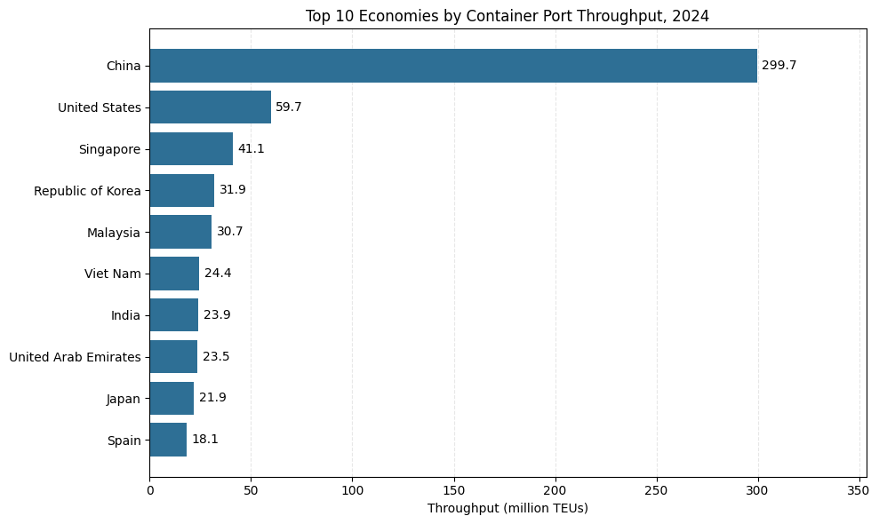
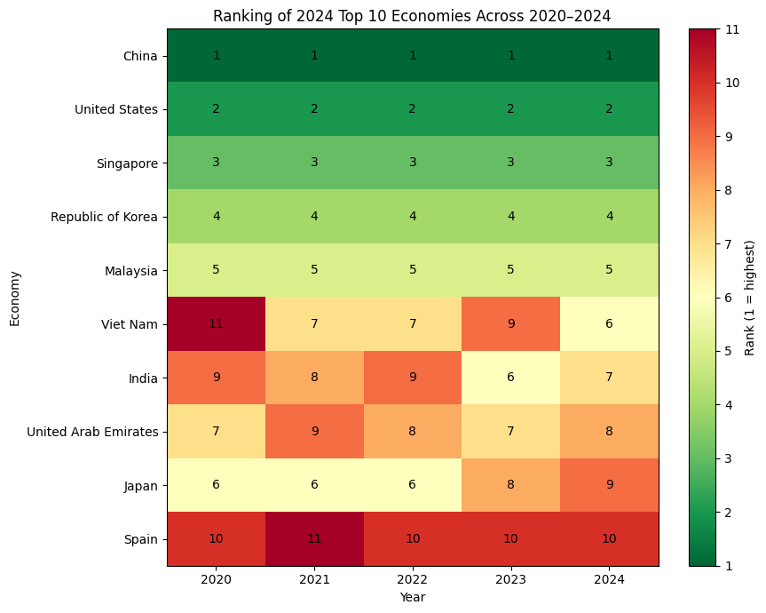
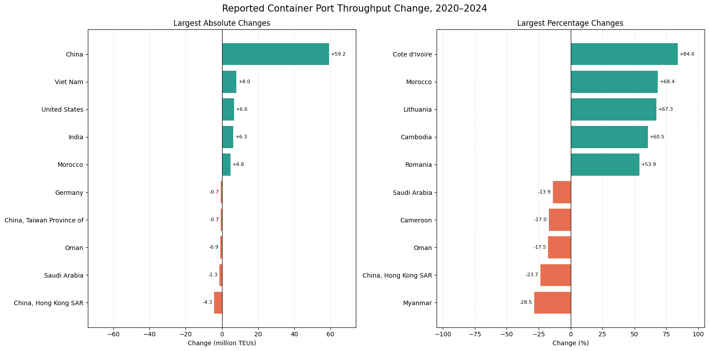
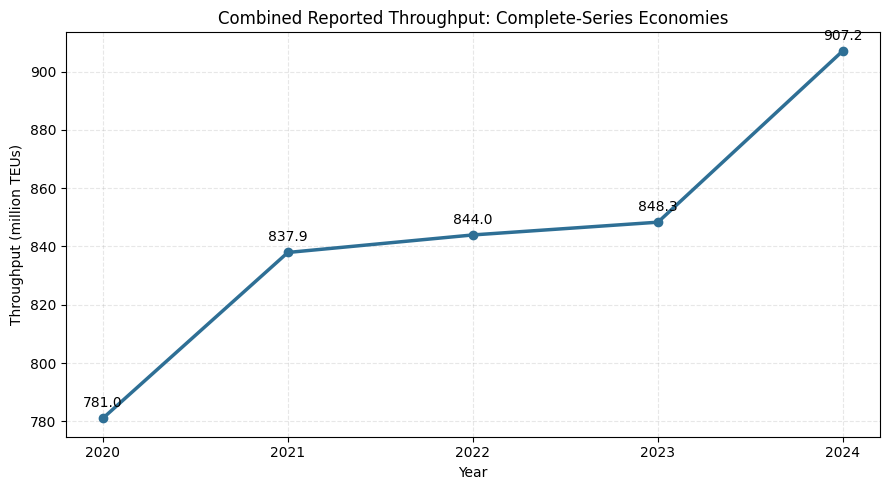
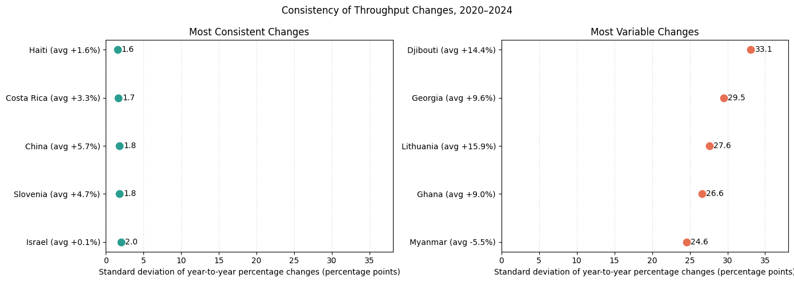

# Global Container Port Throughput Analysis

## Overview

A Python analysis of annual container port throughput reported for economies in UNCTADstat from 2020 to 2024. Throughput is measured in twenty-foot equivalent units (TEUs). The project compares reported volumes, rank changes, absolute and percentage changes, and year-to-year variability.

## Data source

UNCTADstat — **Container port throughput, annual (analytical)**, 2020–2024. Download the data as a ZIP file and place it in the `data/` folder for reference.

## Run the notebook

1. Open [`Container_Port_Throughput_Analysis.ipynb`](notebooks/Container_Port_Throughput_Analysis.ipynb) in Google Colab.
2. Upload the UNCTADstat ZIP file to the Colab session.
3. Run the notebook cells in order. The notebook extracts and reads the uploaded ZIP file.

## Project folders

```text
.
├── data/             # Downloaded UNCTADstat ZIP file
├── docs/             # Full report and executive summary PDFs
├── notebooks/        # Google Colab analysis notebook
├── screenshots/      # Selected project screenshots
└── visualizations/   # Exported charts
```
## Visualizations

### Q1 — 2024 throughput leaders


### Q2 — Rank changes, 2020–2024


### Q3 — Absolute and percentage changes, 2020–2024


### Q4 — Combined throughput trend


### Q5 — Year-to-year variability


## Reports

- [One-page executive summary](docs/Global_Container_Port_Throughput_Executive_Summary.pdf)
- [Full report](docs/Global_Container_Port_Throughput_Full_Report.pdf)
